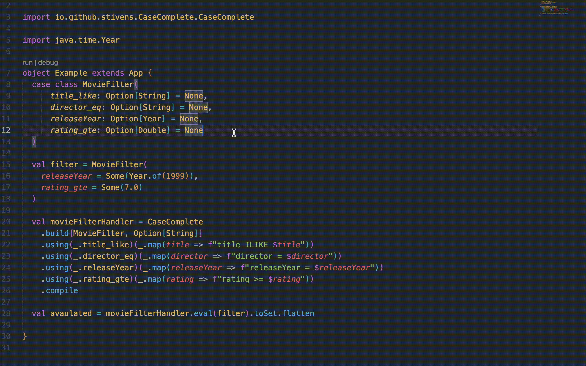

# CaseComplete

A Scala 3 library that provides compile-time guarantees for complete case class field handling. CaseComplete ensures that all fields of a case class are processed by your transformation logic, preventing runtime errors from forgotten fields.



## Features

- **Compile-time Safety**: Ensures all case class fields have corresponding handlers
- **Type-safe Field Selection**: Uses field selectors like `_.fieldName` for type safety
- **Optional Field Support**: Built-in support for `Option` fields with `usingNonEmpty`
- **Builder Pattern**: Fluent API for building field handlers
- **Macro-based**: Leverages Scala 3 macros for compile-time validation

## Installation


Add CaseComplete to your `build.sbt`:

```scala
libraryDependencies += "io.github.stivens" %% "casecomplete" % "0.1.0"
```

## Quick Start

```scala
import io.github.stivens.CaseComplete.CaseComplete

import doobie.*

case class MovieFilter(
  title_like: Option[String] = None,
  director_eq: Option[String] = None,
  releaseYear: Option[Year] = None,
  rating_gte: Option[Double] = None
)

// Create a handler that transforms MovieFilter to SQL conditions
val movieFilterHandler = CaseComplete.build[MovieFilter, Option[Fragment]]
  .usingNonEmpty(_.title_like)(title => fr"title ILIKE $title")
  .usingNonEmpty(_.director_eq)(director => fr"director = $director")
  .usingNonEmpty(_.releaseYear)(year => fr"release_year = $year")
  .usingNonEmpty(_.rating_gte)(rating => fr"rating >= $rating")
  .compile

// Use the handler
val filter = MovieFilter(
  releaseYear = Some(Year.of(1999)),
  rating_gte = Some(7.0)
)

val conditions = movieFilterHandler.eval(filter).toSet.flatten
// Returns: Set(fr"release_year = ${1999}", fr"rating >= ${7.0}")
```

## How It Works

CaseComplete uses Scala 3's macro system to:

1. **Track Handled Fields**: The builder tracks which fields have been handled through type parameters
2. **Compile-time Validation**: When you call `.compile()`, it verifies all case class fields have handlers
3. **Field Name Extraction**: Extracts field names from selectors like `_.fieldName` at compile time

## API Reference

### CaseComplete.build

Creates a new builder instance:

```scala
object CaseComplete {
  def build[SOURCE_TYPE <: Product, TARGET_TYPE]: CaseCompleteBuilder[SOURCE_TYPE, TARGET_TYPE, EmptyTuple]
```

### Builder Methods

#### `using(field)(handler)`

Registers a handler for a specific field:

```scala
builder.using(_.fieldName)(value => transformedValue)
```

#### `usingNonEmpty(field)(handler)` (for Option fields)

Registers a handler for optional fields, automatically handling `None`:

```scala
builder.usingNonEmpty(_.optionalField)(value => transformedValue)
// equivalant to builder.using(_.optionalField)((_: Option[F]).map((value: F) => transformedValue))
```

#### `compile`

Compiles the handler and validates all fields are handled:

```scala
val builder: CaseCompleteBuilder[A, B, _] = ???
val handler: CaseComplete[A, B] = builder.compile
```

### Handler Usage

```scala
val result = handler.eval(sourceInstance)
// Returns: List[TargetType]
```

## Requirements

- Scala 3.x

## Contributing

Contributions are welcome! Please feel free to submit a Pull Request.

## License

This project is licensed under the MIT License - see the LICENSE file for details.
