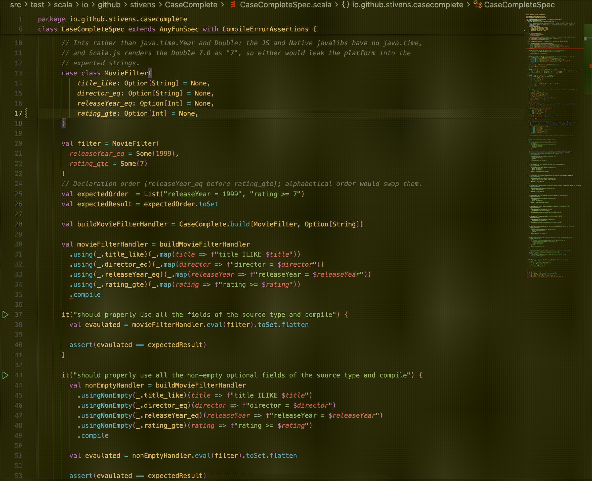

# CaseComplete [](https://maven-badges.sml.io/sonatype-central/io.github.stivens/casecomplete_3) [](https://scala-steward.org)

A Scala 3 library that fails compilation when a case class field has no handler.
You register one handler per field, and `.compile` rejects the code if any field is missing, so adding a field to a case class points you at every place that needs updating.

**Documentation: <https://stivens.github.io/CaseComplete/>**



## Installation

[](https://maven-badges.sml.io/sonatype-central/io.github.stivens/casecomplete_3)

```scala
libraryDependencies += "io.github.stivens" %% "casecomplete" % "1.0.1"
```

Use `%%%` for Scala.js and Scala Native. For scala-cli: `//> using dep io.github.stivens::casecomplete:1.0.1`.

Requires Scala 3.3 or newer.

## Quick start

```scala
import io.github.stivens.casecomplete.CaseComplete

import doobie.*
import doobie.implicits.*

case class MovieFilter(
  title_like: Option[String] = None,
  director_eq: Option[String] = None,
  releaseYear_eq: Option[Int] = None,
  rating_gte: Option[Double] = None
)

val movieFilterHandler = CaseComplete.build[MovieFilter, Option[Fragment]]
  .usingNonEmpty(_.title_like)(title => fr"title ILIKE $title")
  .usingNonEmpty(_.director_eq)(director => fr"director = $director")
  .usingNonEmpty(_.releaseYear_eq)(year => fr"release_year = $year")
  .usingNonEmpty(_.rating_gte)(rating => fr"rating >= $rating")
  .compile

movieFilterHandler.eval(MovieFilter(releaseYear_eq = Some(1999), rating_gte = Some(7.0))).flatten
// List(Fragment("release_year = ? "), Fragment("rating >= ? "))
```

Leave out any of the four handlers and this fails to compile, with an error naming the missing field.

To find out more, see the documentation site:

- [Why not pattern matching?](https://stivens.github.io/CaseComplete/why/)
- [API reference](https://stivens.github.io/CaseComplete/api/)
- [Compatibility policy](https://stivens.github.io/CaseComplete/compatibility/)

## Working on the docs

The site's sources are in [`website/docs`](website/docs). mdoc compiles every snippet against the library, and MkDocs Material renders the site.

```bash
sbt docs/mdoc                                   # or "docs/mdoc --watch"
pip install -r website/requirements.txt
mkdocs serve -f website/mkdocs.yml
```

## Contributing

Contributions are welcome! Please feel free to submit a Pull Request.

## License

MIT. See [LICENSE](LICENSE).
